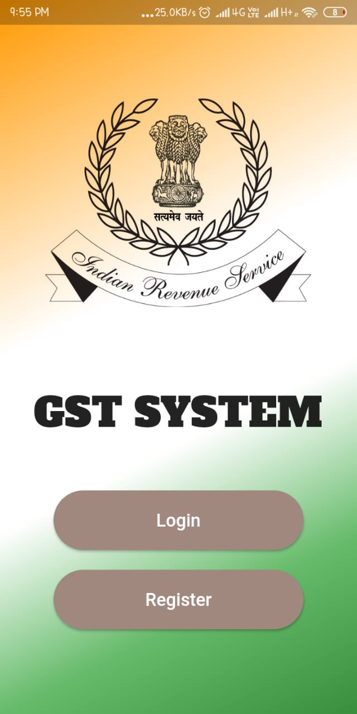
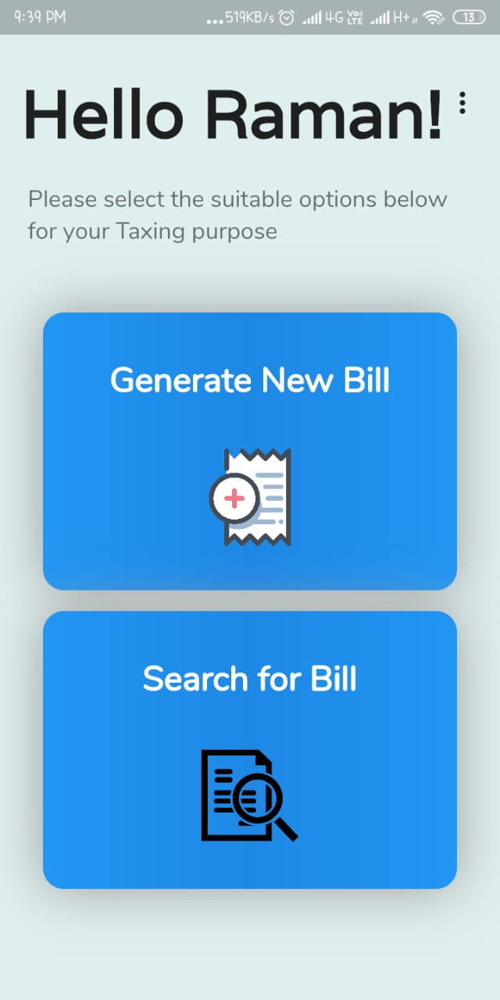
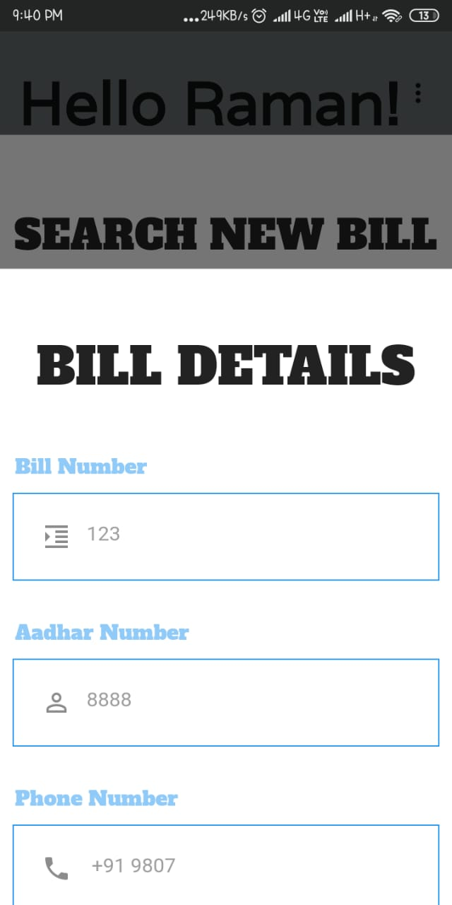
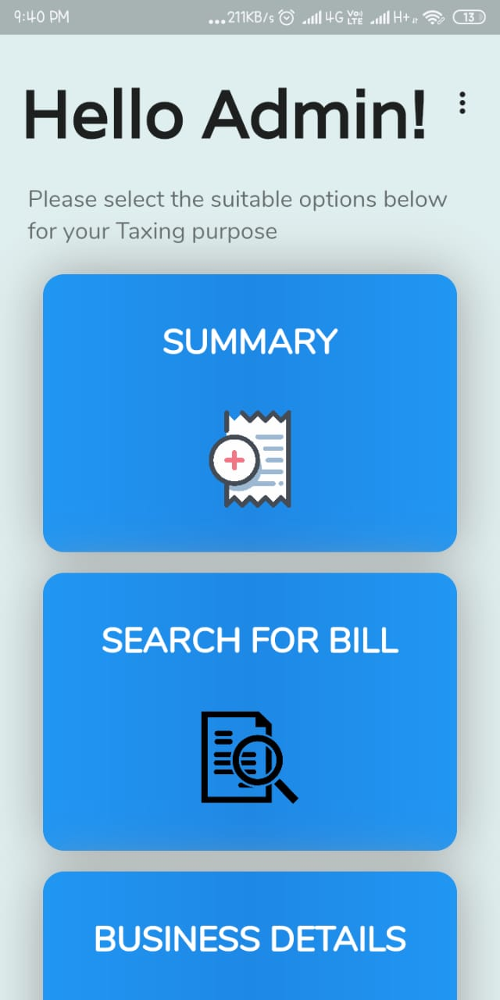

# GST System

> No more tax evasion.

The goal of this app is to reduce tax evasion using a decentralised and secure Block Chain System.

<!-- ## Getting Started -->

<!-- This project is a starting point for a Flutter application. -->

<!-- A few resources to get you started if this is your first Flutter project: -->

<!-- - [Lab: Write your first Flutter app](https://flutter.dev/docs/get-started/codelab) -->
<!-- - [Cookbook: Useful Flutter samples](https://flutter.dev/docs/cookbook) -->

<!-- For help getting started with Flutter, view our
[online documentation](https://flutter.dev/docs), which offers tutorials,
samples, guidance on mobile development, and a full API reference. -->

## Screens

## Problem Statement
- According to tribuneindia.com, there have been 20,233 cases of GST evasion worth Rs 93,642.08 crores since July 2017.
- The main reason is many fraud bills are generated .
- So a trustworthy system is required which could cater the need of aquiring correct information of the tax generated by buying various goods and hence prevent GST evasion.

## Approach
- Concept of Block Chain can help as a solution to evasion.
- It is a decentralized, distributed ledger technology that records the provenance of a digital asset.
- A block chain system where all kind of business are registered by their GST number.

## Software/Technologies Used
- Ethereum Block Chain
- Matic Mumbai Testnet
- Flutter
- Remix IDE

## Functionalities
- [ ]  Business can register using GST number
- [ ]  Business can generate bill for customers (GST to be paid directly to government)
- [ ]  Government can view bills of all business
- [ ]  Business can also view all its bills 

## [Link to Presentation](https://drive.google.com/file/d/1pNYX4b3dvrzvH-n4z-YidrzLbwVAtRiE/view?usp=sharing)
## [Link to Youtube Video](https://youtu.be/i8nmlbLKPhg)
## [Link to Flutter App](https://drive.google.com/file/d/1UKF5iXIwtfVHbouAReMNaC03vaYqO2Fe/view?usp=drivesdk)

	Made with :heart: by <a href="#">Codewiz</a>

